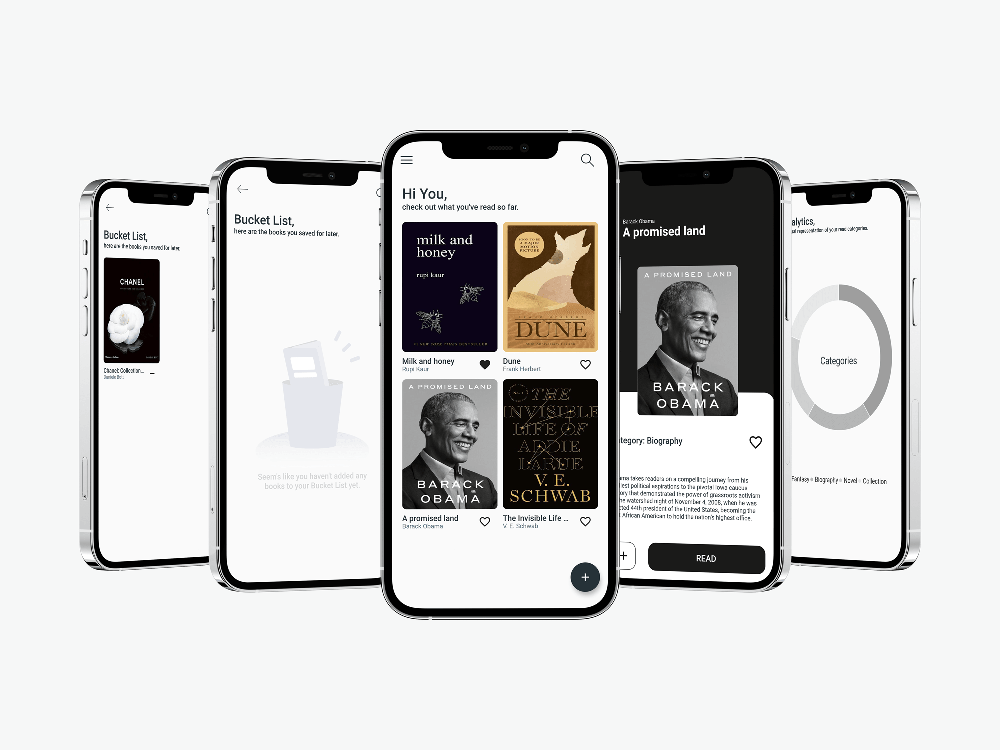

# booc
Your reading history in one place.




## Test It

- Download this project.
- Run ``` flutter build apk ```
- Go to build/app/outputs/flutter-apk/
- Copy the app-release.apk to your Android Device
- On your Android Device, install the .apk

### Next Steps

- Implement user Login
- Implement backend communication with Google Books API
- Recommendations for a user based on his reading history